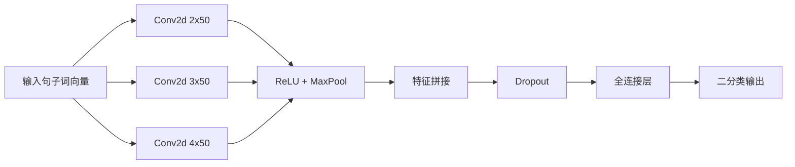

# 人工智能导论实验二报告

学号：2024010701  
姓名：张芝源

## 1. 实验内容

本次实验的任务是完成中文影评数据上的二分类情感分析。数据集已经完成分词，标签含义如下：

- `0`：负向情感
- `1`：正向情感

按照实验要求，我实现了 `CNN` 和 `RNN` 两个模型，并额外实现了 `MLP` baseline 和 `BiGRU` 改进模型用于对比分析。

## 2. 数据集与预处理

### 2.1 数据集

实验使用的数据文件如下：

- `train.txt`
- `validation.txt`
- `test.txt`
- `wiki_word2vec_50.bin`

三个文本文件格式一致，每一行的第一个元素是标签，后续是已经完成分词的中文句子。词向量文件是预训练的 `50` 维 `Word2Vec` 模型。

### 2.2 预处理流程

预处理过程如下：

1. 读取每一行文本，拆分标签和词序列。
2. 使用预训练 `Word2Vec` 将每个词映射为 `50` 维词向量。
3. 对未登录词使用全零向量代替。
4. 训练集、验证集和测试集统一使用训练集中的最大句长进行截断或补零。

不同模型对应的输入形式如下：

- `CNN`：`[N, 1, max_len, 50]`
- `RNN / BiGRU`：`[N, max_len, 50]`
- `MLP`：将句子压缩为固定长度句向量后输入

## 3. 模型结构图

### 3.1 CNN 模型结构图

各部分作用如下：

- 输入层：将一个句子表示成词向量矩阵。
- 卷积层：用不同尺寸卷积核提取局部短语特征。
- ReLU：引入非线性表达能力。
- 最大池化：保留每个卷积核最强的响应。
- 特征拼接：融合多尺度局部信息。
- Dropout：减少过拟合。
- 全连接层：将提取到的特征映射到二分类输出。

### 3.2 RNN 模型结构图

各部分作用如下：

- 输入层：将句子表示为词向量序列。
- LSTM：按词序逐步读取句子，保留上下文信息。
- 池化层：对所有有效时间步做均值池化和最大池化，并拼接成句子表示。
- 全连接层：完成最终二分类。

### 3.3 额外模型说明

#### MLP baseline

MLP 不显式建模词序，但也不是直接对整句做一次简单平均。本实验中的 MLP 先对每个词向量分别通过两层全连接映射，再对整句做池化，最后进行分类。具体做法为：

- 对每个词向量做两层 MLP 映射
- 对整句做均值池化和最大池化
- 将两种池化结果拼接后送入分类层

这种做法仍然不显式利用词序，因此可以视为 MLP baseline，但表达能力比“直接平均句向量再分类”更强。

#### BiGRU 改进模型

BiGRU 与单向 RNN 的区别是同时使用正向和反向两个方向建模句子，从而综合利用前文和后文信息。

## 4. 实验流程描述

整个实验流程如下：

1. 读取训练集、验证集和测试集。
2. 使用 `Word2Vec` 将分词结果转成词向量。
3. 对句子做统一长度处理。
4. 构造不同模型所需的输入格式。
5. 使用训练集训练模型。
6. 每个 epoch 后在验证集上计算损失与准确率。
7. 使用 early stopping 保存验证集上最优模型。
8. 训练完成后在测试集上计算 `Accuracy`、`Precision`、`Recall` 和 `F-score`。

训练设置如下：

- 框架：`PyTorch`
- 词向量：`wiki_word2vec_50.bin`
- batch size：`64`
- 优化器：`Adam`
- 学习率：`0.001`
- 损失函数：`CrossEntropyLoss`
- early stopping：验证集 `val_loss` 连续若干轮不下降则停止
- 运行设备：`CUDA`

## 5. 评价指标

本实验使用以下指标：

### 5.1 Accuracy

\[
Accuracy = \frac{TP + TN}{TP + TN + FP + FN}
\]

### 5.2 Precision

\[
Precision = \frac{TP}{TP + FP}
\]

### 5.3 Recall

\[
Recall = \frac{TP}{TP + FN}
\]

### 5.4 F-score

实验中采用的是二分类常用的 `F-score`，具体为：

\[
F = \frac{2 \times Precision \times Recall}{Precision + Recall}
\]

## 6. 实验结果展示

我不仅完成了 `CNN` 与 `RNN` 两个必做模型，还额外实现了 `MLP` baseline 和 `BiGRU` 改进模型。测试集结果如下：

| 模型 | Accuracy | Precision | Recall | F-score |
|------|----------|-----------|--------|---------|
| MLP | 0.8401 | 0.8478 | 0.8342 | 0.8410 |
| CNN | 0.8238 | 0.8506 | 0.7914 | 0.8199 |
| RNN | 0.8320 | 0.8655 | 0.7914 | 0.8268 |
| BiGRU | 0.8482 | 0.8830 | 0.8075 | 0.8436 |

从结果看：

- 四个模型的 `Accuracy` 和 `F-score` 都超过了 `80%`。
- `BiGRU` 的 `Accuracy` 最高，`MLP` 的 `F-score` 最高，二者整体表现最好。
- `CNN` 的结果稳定，也达到了实验要求。
- `RNN` 经过改进后也稳定超过了 `80%`，说明长度处理与句子表示方式对序列模型结果影响较大。
- `BiGRU` 的 `Precision` 最高，说明双向序列结构在正类预测上较为稳健。

## 7. 参数对比分析

本实验没有做大规模参数搜索，但在实现过程中仍然做了一些有意义的结构和参数选择，对最终效果有明显影响。

### 7.1 CNN 参数设计

CNN 没有只使用单一卷积核，而是使用了三种卷积核尺寸：

- `(2,50)`
- `(3,50)`
- `(4,50)`

这样做的原因是：

- 较小卷积核更适合提取短语级情感特征
- 多尺度卷积核能同时覆盖不同长度的局部模式

实验结果表明，多卷积核的 `CNN` 能稳定达到 `80%` 以上的准确率，说明这种设计是有效的。

### 7.2 RNN 长度处理

在 `RNN` 中，如果直接取统一的最后一个时间步输出，会把 padding 的位置误认为句尾，从而导致模型效果很差。  
因此本实验没有直接取固定位置，而是结合真实句长，对所有有效时间步做均值池化和最大池化，再拼接成句子表示。这一处理对 `RNN` 的效果提升比较明显，也是它最终稳定超过 `80%` 的关键原因之一。

### 7.3 MLP 结构设计

本实验中的 `MLP` 没有直接把整句先压成一个固定句向量，而是先对每个词向量做非线性映射，再做：

- 均值池化
- 最大池化

这种做法相比“直接平均句向量”保留了更多区分信息，也明显提升了效果。  
在实验过程中，最开始的简单 `MLP` 版本准确率不到 `80%`，只能达到 `77%` 左右；后续将模型改成“词级两层 MLP + 均值池化 + 最大池化 + 分类层”的结构后，测试集 `Accuracy` 提升到了 `0.8401`，`F-score` 提升到了 `0.8410`。这说明对于 `MLP` 来说，输入表示和池化方式的设计非常关键。

### 7.4 BiGRU 结构改进

相比单向 `RNN`，`BiGRU` 引入了双向结构，理论上可以同时利用前文和后文信息。实验结果表明，`BiGRU` 的 `Accuracy` 和 `F-score` 都高于单向 `RNN`，说明双向建模在当前任务上带来了较明显提升。

## 8. 模型比较

### 8.1 MLP、CNN、RNN、BiGRU 的整体比较

从结果上看，性能排序大致为：

`BiGRU ≈ MLP > RNN > CNN`

说明：

- `MLP` 在改进输入表示和池化方式后，效果已经明显强于最初的简单 baseline。
- `BiGRU` 的综合表现最好，说明双向序列建模对该任务有帮助。
- `CNN` 仍然保持了比较稳定的结果，说明局部短语特征对情感分类是有效的。
- `RNN` 单向模型经过改进后也能稳定达到较好效果，但整体仍略低于 `BiGRU`。

### 8.2 针对本次实验的性能差异分析

从这次实验的数据特点来看，输入是已经分词的中文影评文本，情感判断既依赖局部短语，也依赖整句语义信息。

1. `MLP` 最终效果较好，说明在当前实验设置下，预训练词向量本身已经提供了较强的语义表示能力。对每个词向量先做非线性映射，再通过均值池化和最大池化汇总整句信息，能够较充分地提取全局情感线索。

2. `CNN` 的 `Precision` 较高，说明它在识别局部情感短语方面比较有效。例如“非常 失望”“特别 喜欢”这类连续词组，比较容易被卷积核捕捉到。但 `Recall` 相对低一些，说明它对一些需要更长上下文的信息覆盖不如序列模型充分。

3. 单向 `RNN` 的结果相对更容易波动，这与它对 padding 处理、真实长度提取以及训练细节较敏感有关。虽然它能够利用顺序信息，但在当前实验中，这种优势没有稳定转化成最优结果。

4. `BiGRU` 比单向 `RNN` 更稳，说明在影评情感分类中，同时利用前向和后向上下文确实是有帮助的。由于一句评论中的情感判断常常依赖前后文共同决定，双向结构更适合这类输入。

### 8.3 从模型结构角度的比较

如果脱离这次具体实验，单从模型结构本身看，不同模型更适合的问题也不一样。

1. `MLP` 不显式建模顺序，适合输入已经具有较强语义表达能力、且任务更依赖整体统计信息的场景。它结构简单、训练快，但对词序和长距离依赖不敏感。

2. `CNN` 更适合提取局部模式，尤其适用于局部 n-gram 特征很重要的问题，例如文本分类、关键词触发类任务等。它并行性好、训练稳定，但对长距离依赖处理有限。

3. `RNN` 适合顺序信息重要的任务，例如语言建模、序列标注、时间序列问题等。它天然适合处理上下文依赖，但训练速度慢，且容易受到梯度传播和实现细节影响。

4. `BiGRU` 或其他双向序列模型更适合那些“当前判断依赖前后文共同决定”的任务，例如情感分类、命名实体识别、文本理解等。它通常比单向模型表达能力更强，但结构也更复杂。

### 8.4 各模型优缺点

#### MLP

优点：

- 结构简单
- 实现容易
- 训练速度快

缺点：

- 不显式利用词序
- 对长距离依赖和严格顺序关系的表达不如 `RNN`
- 对局部连续短语结构的建模不如 `CNN` 直接

#### CNN

优点：

- 擅长提取局部 n-gram 特征
- 并行性好
- 训练稳定

缺点：

- 对长距离依赖建模能力有限
- 对全局顺序信息利用不足

#### RNN

优点：

- 能按顺序处理文本
- 更适合建模上下文信息
- 改进后能够稳定超过 `80%`

缺点：

- 训练速度相对慢
- 对 padding 和长度处理更敏感

#### BiGRU

优点：

- 同时利用正向和反向信息
- 结果稳定
- 作为改进模型有一定参考价值

缺点：

- 结构更复杂
- 相比单向 `RNN` 并未带来特别明显的提升

## 9. 问题思考

### 9.1 训练什么时候停止最合适

本实验使用的是基于验证集的 early stopping，而不是固定轮数训练。

具体做法：

- 每轮训练结束后计算验证集 `val_loss`
- 若 `val_loss` 优于历史最优值，则保存当前模型
- 若验证集损失连续若干轮不下降，则停止训练

优点：

- 能根据泛化效果动态决定停止时机
- 可以减少过拟合
- 比固定轮数更稳妥

缺点：

- 训练流程更复杂
- 结果受验证集划分影响

相比之下，固定迭代次数实现简单，但可能训练不足，也可能过拟合，因此不如验证集早停合理。

### 9.2 参数初始化怎么做

本实验使用的是 `PyTorch` 默认初始化方式，没有额外手动指定初始化方法。

常见初始化方式包括：

- 零初始化：容易导致神经元学习到相同特征，不适合隐藏层权重
- 高斯初始化：较常见，但分布方差设置不当会影响训练稳定性
- Xavier 初始化：适合前馈网络
- He 初始化：更适合 `ReLU`
- 正交初始化：常用于 `RNN/LSTM/GRU`

如果继续改进，可以尝试在 `RNN/BiGRU` 中使用正交初始化，在 `CNN/MLP` 中尝试 Xavier 或 He 初始化。

### 9.3 如何防止过拟合

常见方法包括：

- 使用验证集早停
- 使用 Dropout
- 减小模型复杂度
- 增加训练数据
- 加入正则化

本实验中实际采用了：

- `Dropout`
- `Early Stopping`

这两种方法对提升泛化能力是有效的。

### 9.4 CNN、RNN、MLP 三者的优缺点

这个问题在前面的模型比较部分已经有较详细说明。简要总结如下：

- `MLP`：简单，但表达能力有限
- `CNN`：局部特征提取强，训练稳定
- `RNN`：顺序建模能力强，更适合上下文依赖明显的任务

### 9.5 模型鲁棒性分析

从当前实验结果看：

- `MLP`、`CNN`、`RNN` 和 `BiGRU` 的泛化效果都较稳定
- `RNN` 相比 `BiGRU` 对训练细节更敏感，但经过改进后也能取得稳定结果
- `MLP` 的表现说明，不显式建模顺序并不一定意味着效果一定较差，关键还在于输入表达和池化方式设计是否合适

如果继续扩展实验，可以另外收集少量影评数据作为额外测试集，观察模型在外部样本上的性能变化，以更系统地分析鲁棒性。

## 10. 附加工作与改进尝试

除了完成实验要求中的 `CNN` 和 `RNN` 外，我还做了以下扩展：

1. 实现了 `MLP` 作为 baseline，用于和卷积模型、序列模型对比，并对其结构做了改进，使其从不到 `80%` 的简单版本提升到 `84%` 左右的测试准确率。
2. 在 `CNN` 中使用了多尺度卷积核，而不是单一卷积核。
3. 在 `RNN` 中按真实长度提取最后一个有效时间步输出，避免 padding 干扰。
4. 额外实现了 `BiGRU` 作为扩展模型，用于考察双向结构的效果。
5. 对所有模型统一采用验证集和 early stopping 训练策略，保证结果可比较。

这些工作使实验结果不只是“完成必做题”，而是形成了一个较完整的模型对比实验。

## 11. 心得体会

这次实验让我对文本分类中的三类典型模型有了更具体的认识。

一开始我更多是从代码角度理解模型，但在实现过程中，我逐渐意识到：

- `CNN` 的关键在于局部模式提取
- `RNN` 的关键在于顺序建模
- `MLP` 虽然是 baseline，但只要结构设计合理，也可以取得比较强的结果

另外，我也更清楚地体会到，真正影响实验结果的不只是模型名字本身，还包括：

- padding 的处理方式
- 验证集的使用
- early stopping
- dropout
- 指标选择

尤其是在 `RNN` 中，如果不按真实长度提取最后一个有效时间步，模型几乎学不动。这让我对“实现细节决定最终效果”这件事有了更直接的认识。

整体来看，这次实验不仅完成了模型实现，也帮助我把课堂上关于卷积网络、循环网络和全连接网络的概念和实际任务联系了起来。
